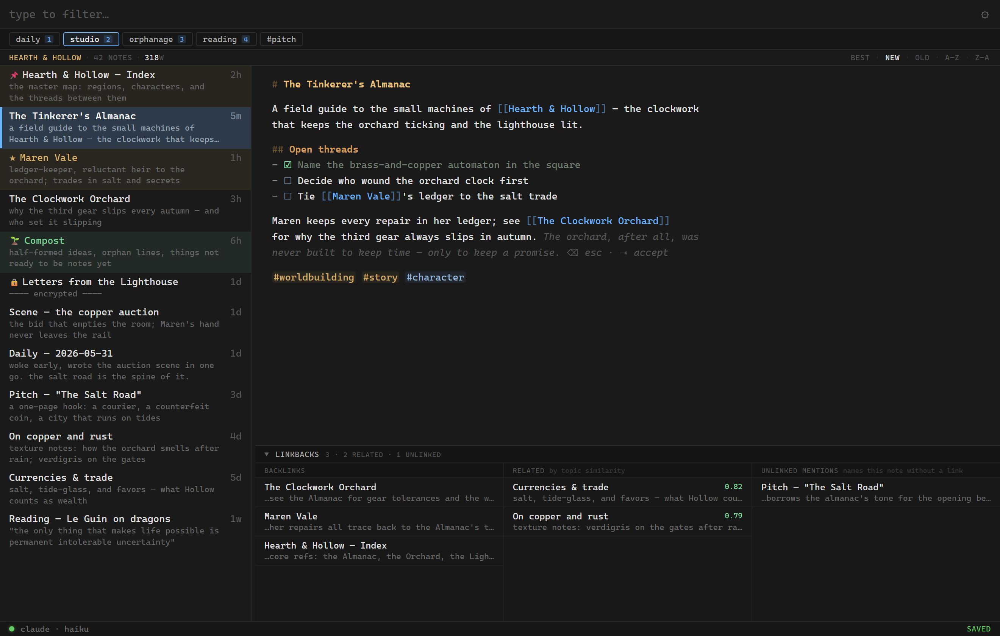

# malt

> **Distill notes. Brew ideas.**

A cross-platform AI-augmented [nvalt](https://brettterpstra.com/projects/nvalt/)
successor. Plain `.md` files in a single flat folder, instant type-to-filter
search, and a silent AI layer that proposes tags, wikilinks, and continuations
without ever blocking the writer.

malt is for people who want the speed of nvalt with the connective tissue of
Roam/Obsidian/Tana, without locking their notes into a proprietary database.



<sub>*A sample vault with invented notes — your notes stay plain `.md` files in a folder you choose.*</sub>

---

> ### Status: a personal project, shared as-is
>
> I build malt for my own daily use and develop it in the open — partly so the
> auto-updater works across my machines, partly because a few people find it
> handy. It is **not a supported product**: there's no roadmap I'm committed
> to, no SLA, and no promise that I'll answer issues or merge pull requests.
>
> You're very welcome to use it, fork it, and send patches — just calibrate
> expectations accordingly. Treat it like someone's lovingly-maintained
> dotfiles, not a company's app. See [SUPPORT.md](SUPPORT.md).

---

## What's inside

- **Plain markdown, plain folder.** Your notes are `.md` files in `~/malt/`
  (configurable, e.g. point it at a Dropbox folder). No `.app/data/` or sqlite
  vault to extract from later. Delete malt tomorrow and your notes are still
  notes.
- **Instant search.** Tantivy-powered fuzzy + prefix filter on every keystroke.
  Real nvalt feel: the search bar both filters and creates (type a title, press
  Enter).
- **Wikilinks + backlinks.** `[[link]]` with autocomplete, broken-link styling,
  atomic rename + back-reference rewrite. A backlinks panel shows what links
  here, plus "unlinked mentions" (notes that name this one in prose) you can
  wire up in one click.
- **Tags as search shortcuts.** Inline `#hashtags` relocate to a hidden
  canonical line and render as pills. Vocabulary autocomplete, hierarchical
  `#a/b` tags, and optional per-tag **flair** (icon + color on note cards).
- **Saved searches + discovery reports.** `Cmd/Ctrl+S` to save a query,
  `Cmd/Ctrl+1..9` to recall. Operators compose: `tag:foo -tag:bar modified:<7d`.
  Built-in lenses: `is:orphan` (notes adrift from the link graph), `is:onthisday`,
  `is:duplicate` (near-identical twins, via embeddings), `is:encrypted`.
- **Semantic search & related notes.** A leading `~` ranks by meaning, not
  keywords. Related notes appear beside backlinks. All local, offline, per-vault
  — [fastembed-rs](https://crates.io/crates/fastembed) + sqlite-vec, no cloud.
- **Split panes + two-pane prompting.** `Cmd/Ctrl+click` a row or link to open
  the second pane. `Cmd/Ctrl+Shift+'` sends the other pane as a raw pre-prompt
  for the focused one — turn a note into a reusable AI prompt.
- **AI assistance** (optional, bring your own key — Anthropic, OpenAI, DeepSeek,
  Grok, or Gemini):
  - `Cmd/Ctrl+;` — ghost-text continue at the cursor; with a selection, rewrite it.
  - `Cmd/Ctrl+Shift+;` — *steer*: a one-line direction note for the generation.
  - `Cmd/Ctrl+Shift+B` — *Brew*: brainstorm on the current note in a side pane.
  - `Cmd/Ctrl+Shift+L` — review proposed `[[wikilinks]]` (title matches + entities).
  - Optional background auto-tagging (off by default).
- **Per-note encryption.** AES-256-GCM + Argon2id, one note at a time. The file
  stays a single `MALT-ENC-v1:` line so sync tools keep working.
- **Daily notes, pinned notes, zen mode, task checkboxes, random note,** multiple
  **vaults,** and per-note **exports** (`.md` / `.html` / `.epub` / `.txt`).
- **Keyboard-first, dark, dense.** Every shortcut is documented in
  Settings → Shortcuts, and the in-app **Tips** (Settings → Tips) walk you
  through the surface.

See [CHANGELOG.md](CHANGELOG.md) for the full per-release feature list.

## Your notes are yours

malt never holds your content hostage. Notes are plain `.md` files you can read,
edit, sync, grep, or back up with any tool. Everything malt derives — the search
index, embeddings, config, pins — lives in a sidecar config directory, never
mixed into your notes folder.

> ⚠️ **Encryption has no recovery.** Encrypted notes are protected by your
> password and nothing else — there is no backdoor or reset. Lose the password,
> lose the note. Keep important passwords backed up somewhere safe.

## Install

Pre-built installers ship from the [releases page](../../releases) — Windows
`.msi`/`.exe` and macOS `.dmg` (Apple Silicon). Builds are **unsigned**, so the
OS will warn on first launch:

- **Windows:** SmartScreen → "More info" → "Run anyway".
- **macOS:** right-click the `.app` → "Open" the first time (a plain
  double-click is blocked by Gatekeeper).

Once installed, **Settings → About → Check for Updates** uses a signed,
self-updating channel (the update payload is cryptographically verified even
though the installer itself is unsigned). Code-signing proper is a someday-maybe.

## Build from source

Prerequisites:

- [Rust](https://rustup.rs/) (stable)
- [Node.js](https://nodejs.org/) 20+
- Platform Tauri prerequisites:
  [Windows](https://v2.tauri.app/start/prerequisites/#windows) /
  [macOS](https://v2.tauri.app/start/prerequisites/#macos) /
  [Linux](https://v2.tauri.app/start/prerequisites/#linux)

```bash
git clone https://github.com/MichaelCarychao/malt.git
cd malt
npm install
npm run tauri dev      # dev mode, hot reload
npm run tauri build    # release installer
```

The first build is slow (~5–15 min — fastembed + tantivy + onnxruntime pull in
a lot). Subsequent builds are fast. Before sending a patch, `npm run check` and
`cargo check --manifest-path src-tauri/Cargo.toml` should both be clean.

## Support & contributing

There is **no support** — please read [SUPPORT.md](SUPPORT.md) first. Questions
and show-and-tell go in [Discussions](../../discussions); the community helps
each other there. Patches are welcome on the terms in
[CONTRIBUTING.md](CONTRIBUTING.md) (small PRs, MIT, possibly slow or no review).

## License

[MIT](LICENSE) — do what you like; no warranty.
